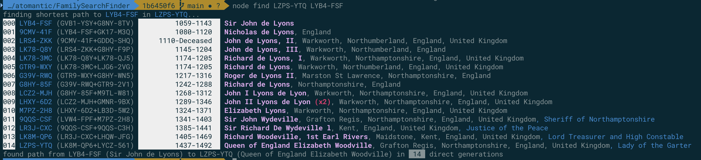
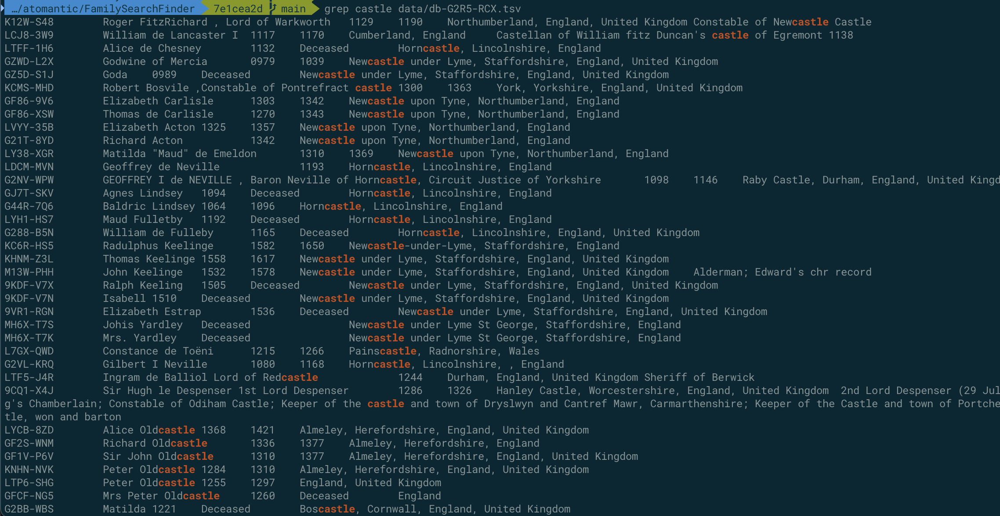
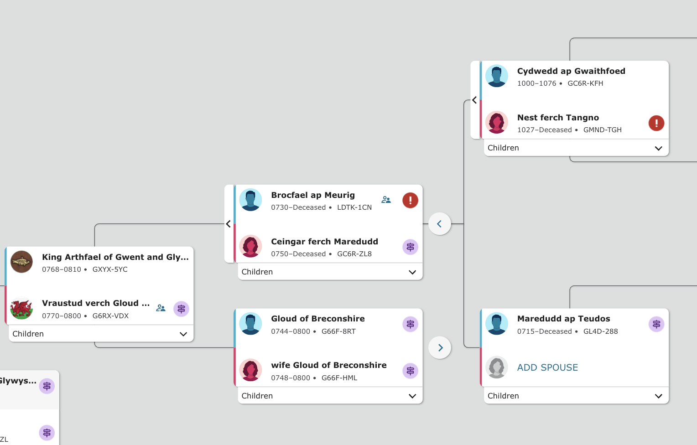

# FamilySearch Tree Download and Lineage Finder

After writing up the Substack article [Monetary Experiments for Every Generation](https://antic.substack.com/p/monetary-experiments-for-every-generation), in which I did a small amount of historical research on one of my grandfathers, learning that he was born in Canada and that his parents were both born in Netherlands, I got the itch to do more research.

I asked a few family members for clues, got enough names to put together a family tree that went out several generations--but I wanted more. So I then found those known figures in some of the public lineage databases and found that FamilySearch had the most robust records, a workable UI, and a rich API.

Once I got poking around the UI, I was surprised to find how deep my ancestry went and I realized I wanted to deeper after finding the super interesting [Guy le Strange](https://www.familysearch.org/tree/person/details/9H8F-V2S) who one historian described as 'of low stature, but of lofy courage' -- then finding [Tigernmas Masius, Lord of Death, mac Follach, 13th High King of Ireland, 1640BC-1543BC (9S8X-B4M)](https://en.m.wikipedia.org/wiki/Tigernmas), who has an amazing story, and died en-masse with 3/4 of the men in Ireland while worshipping "Crom Cruach, a cruel deity propitiated with human sacrifice."

This got me thinking that it would be a fun project to make a sparse family tree with a selection of interesting (albeit not traditionally famous) characters plucked out of history.

Now, I have to take this database with a _huge_ grain of salt because FamilySearch is run by the Mormon church and subscribes to a 6,000 year history of humanity going back to Adam and Eve (born in Utah). Many of the linkages are questionable, and I found many obvious errors that I was able to correct within my own tree (it is a public database that anyone can sign up and edit). In fact, the database has multiple records for Adam (L2M1-HNZ and GLFW-HJY), multiple records for Eve (L8R2-JBH, L8R2-JBH, etc), and several Heavenly Father and Heavenly Mother combinations--though, to their credit, they mark them all as deceased. So even if you believe in the Mormon faith, this database has some work in front of it. Most hilariously, the database has Adam and Eve born 4000BC, but I have relatives from [Peiligang_culture](https://en.wikipedia.org/wiki/Peiligang_culture) that date back to 7000 to 5000 BC!

Additionally, many of the historical linkages could be questionable after a certain point because it's highly likely that either someone after the fact just really wanted to claim that a linkage could be made between some king and their religious texts and made it so--and it's also highly likely that rather than 150 generations up the stack being related to Elizabeth Woodville, Queen consort of England (1437-1492), someone probably made up that they were the offspring lovechild of royalty to get credit during a time when who you were born as was a life or death matter. So take it all with a deep breath and a fanciful interest.

Among the issues I found in my own tree were these:

1. I had a married pair of ancestors who were their own great-grandmother and great-grandfather -- somehow the database doesn't have a simple cyclic check and allows you to link an id downstream of itself. It was pretty clear that this couple didn't time travel to become their own ancestors so I corrected the link.
2. occasionally children would appear under someone who I know did not have that child, and it should have been obvious because the child had a completely different surname.

If you have a circular loop like this, the download script will repeat itself for a while, and you'll notice it's churning really fast over the local cache, so just kill it and correct it in the FamilySearch UI before continuing.

# Using the Code

1. clone this repo
2. run `npm install`
3. Load [FamilySearch](https://www.familysearch.org/tree/pedigree/), open chrome dev tools or whatever you like to inspect your traffic and copy your Authorization header value (sans "Bearer") that you send for a request. It should look something like `p0-xibD_gsA7ZA.O3SFg8ZEfn1` (this one won't work, sorry 🤣)
   - note that these tokens last for a long time (24 hours+) so you won't need to get a new token very often
4. either add that to config.js or supply it at runtime with the `FS_ACCESS_TOKEN` environmental variable like the following step
5. run a command like `FS_ACCESS_TOKEN=YOURACCESSTOKEN node index 9H8F-V2S`
6. run find to get the direct lineage from Guy le Strange (9H8F-V2S) to Fulk
   FitzWarrine (L163-DR5) `node find 9H8F-V2S L163-DR5`

Once you have a database file built for a particular root person, you can run the `find` script to find the number of generations and the links between an ancestor node and that person.

# Scripts

- node index `${ID_OF_CHILD_DB_NODE}` `${maxGenerations}`
  - e.g. `node index 9H8F-V2S`, or `node index 9H8F-V2S 2`
  - this will download the ID of the first person and then download the information for every parent and parent of parent that exists within the database. Note that any repeat IDs will not hit the API. If a `maxGeneration` is supplied, each parent tree will only be crawled to this many generations, else it goes until the database is complete.
    
  - it will then compile a subset of this information into a db file (JSON) in the data directory
    
- node find `${ID_OF_CHILD_DB_NODE}` `${ID_OF_ANCESTOR_TO_SEEK}`
  - optional: `--method=shortest|longest|random` (defaults to shortest path, can also just use single letter `--method=r` or `--method=l`)
  - this will open up `./data/db-${ID_OF_CHILD_DB_NODE}`, locate `${ID_OF_ANCESTOR_TO_SEEK}` and use the children references to back-trace the lineage to the root child and it will print the result as it navigates 
  - In many cases, if you go back far enough, some cousins got married, or if you get to Pharaohs, you'll see a lot of siblings as parents and in some cases even some uglier pairings. In cases where your ancestry links multiple times to the same people in history, you'll see a multiplier marker when it goes to find the path like so:
    
- node tsv `${ID_OF_CHILD_DB_NODE}`
  - this will go through the JSON db file and create a TSV file, which can then be imported into a spreadsheet program 
  - you can then `grep` the tsv file for interesting words:
    
- node purge `${ID_OF_ALTERED_NODE`
  - this will remove all records in your local database for this ID (self, direct parents, direct children)
  - use this after fixing bad relationship records in the public database and then re-run your index to re-download/sync relationships that have changed

# Note on Size

My family tree consists of `83,760` records, which amounts to `2.4GB` of raw data from the API, which then reduces to `25.6MB` in a JSON db file for finding paths, or into `7.8MB` of TSV files for doing plain searches for interesting names/occupations/locations. This script could be tweaked to not save the full payload from the API but I wanted to anyway in case I find other parts of the data that I want to use.
I wanted to search based on individual lines above me, so I created index files for each parent and some grandparents to isolate the lines. By running the database builder multiple times, it will use the existing downloaded person records rather than hitting the API, so once you have done a full export, you can easily/quickly create sub-db files out of the data.

# If The Tree is Updated

Delete the `data/person/${id}.json` for any changed records (e.g. if someone's parent record is updated, delete the affected child) and re-run the database builder (e.g. `node find 9H8F-V2S L163-DR5`)

# Detecting Time Travelers (Cyclic Loops)

The FamilySearch database does not have a simple cyclic checker and therefore allows records to be linked as grand-children of themselves. This appears somewhat frequently and is relatively easy to spot by noticing that the birth year of the parents is after the birth year of the erroneously linked record. A simple fix is to remove the parents (or the child relationship from the parents) in the FamilySearch UI.




Additionally, the longest path find method will detect these cyclic errors and report them to you for easily locating the problem:


Once the record has been fixed in the public database, you should purge the detached child ID record from your local cache:

```
node purge LDTK-1CN
```

Then re-run your indexer for your desired local graphs.
